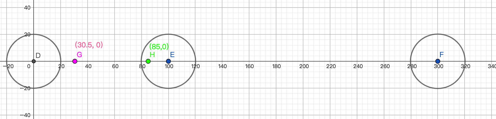
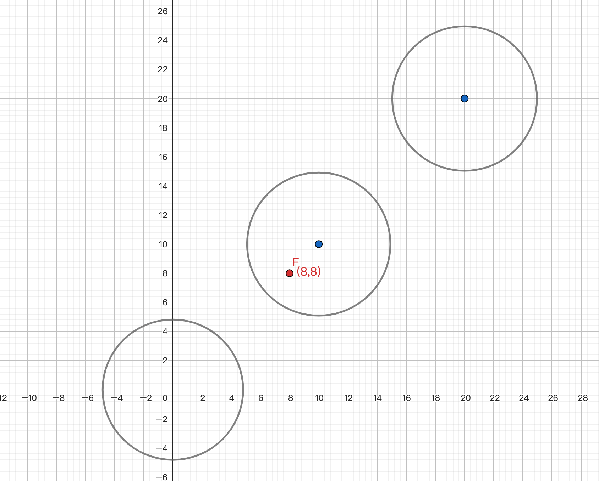

📚 捕获（或者吸附到）特定的增量或者是数组中最接近的值：

- 还可以提供一个可选的 `半径（radius）`
- 还有2维数据，坐标点进行吸附
- 也是存在2种形式，一种直接返回结果，一种是返回一个可复用的函数

它有 `6` 种形式（但可以分为3组）：（用法确实比较多，理解起来也有点绕😅）

1. `snap(snapIncrement, valueToSnap)` 直接返回结果
   - `snapIncrement: Number` - 捕获的增量，比如 `snapIncrement` 设置为 `5`，表示增量为 `5` 的倍数，即 `[0, 5, 10, ...25 ..., 95...]` 等等
   - `valueToSnap: Number` - 结束值，可以是任何数据类型，只要它和 `startValue` 匹配
2. `snap(snapIncrment)` 返回一个可复用的函数
   - `snapIncrement: Number` - 同上
3. `snap(array, valueToSnap)` valueToSnap 匹配array中最接近的值，直接返回结果
   - `array: Array` - 捕获的数组值
   - `valueToSnap: Number` - 待捕获的值
4. `snap(array)` 返回一个可复用的函数
   - `array: Array` - 同上
5. `snap(objectWithRadius, valueToSnap)` 包含 `radius` 的捕获方式，如果没有被捕获到，则直接返回原来的值，最复杂的一种用法🤩，直接返回结果
   - `objectWithRadius: Object` - 可以是 `{values: [0, 20, 60], radius: 5}` 或者是 `{increment: 100, radius: 50}` 这种形式，**values还可以是对象数组，包含 `x` & `y`， 对2D坐标点进行捕获**
   - `valueToSnap: Number` - 待捕获的值
6. `snap(objectWithRadius)` 返回可复用的函数
   - `objectWithRadius: Object` - 同上


1️⃣ `包含snapIncrement` 的形式

🌰 直接返回结果

```js {1-3}
// 💡 相当于可以捕获的值为 `10` 的整数倍
// ... -10 0 10 20 30 ...
// `23.5` 离 `20` 最近 因此被捕获，返回结果为 `20`
gsap.utils.snap(10, 23.5) // 20
```

返回可复用得函数

```js
const snap = gsap.utils.snap(2)

snap(9.5) // 10
snap(-3.2) // -4
```


2️⃣ `包含数组` 的形式

🌰 直接返回结果

```js {1}
// 💡 数组中离 `65` 最近的是 `50` 因此被 `50` 捕获
gsap.utils.snap([100, 50, 500], 65) // 50

gsap.utils.snap([100, 50, 500], 315) // 500
```

返回可复用得函数

```js
const snap = gsap.utils.snap([100, 50, 500])

snap(85)  // 100
snap(415) // 500
```


3️⃣ `包含 objectWithRadius` 配置形式


> 1. `values数组 + radius`

```js
// 没有被捕获，直接返回原值
gsap.utils.snap({
  values: [0, 100, 300],
  radius: 20
}, 30.5) // 30.5

// 被 100捕获，返回 100
gsap.utils.snap({
  values: [0, 100, 300],
  radius: 20
}, 85) // 100
```

数组捕获的半径为 `20`，数组中能捕获的范围如下图圆圈所示，而 `30.5` 不在3个捕获圈中，因此没有被捕获，原路直接返回 `30.5`；而 `85` 则被 `100` 的捕获圈捕获，因此返回 `100`




> 2. `values对象数组 + radius` 对二维点进行捕获

这个原理其实和上面的类似，也是建立一个捕获圈，然后看点是否在某个圈内

```js
// 被捕获
const point = { x: 8, y: 8}
gsap.utils.snap({
  values: [
    {x: 0, y: 0},
    {x: 10, y: 10},
    {x: 20, y: 20}
  ],
  radius: 5
}, point) // {x: 10, y: 10}

// 没有被捕获，直接返回原来的值 {x: 14, y: 16}
gsap.utils.snap({
  values: [
    {x: 0, y: 0},
    {x: 10, y: 10},
    {x: 20, y: 20}
  ],
  radius: 5
}, {x: 14, y: 16})
```

如图所示，`(8, 8)` 坐标点被 `(10, 10)`为中心，半径为 `5` 的捕获圈捕获，因此返回 `{x: 10, y: 10}`




> 3. `increment + radius` 对象形式

这个其实和 `snap(snapIncrement, valueToSnap)` 类似，但是它又结合了 `values` 捕获圈的概念：

```js {1-4}
// 理解
// 可以理解为 values: [..., -500, 0, 500, 1000, ...]
// 半径为 150
// `975` 在 (1000, 0)中心，半径为 150 的捕获圈中
gsap.utils.snap({
  increment: 500,
  radius: 150
}, 975) // 1000
```


复用函数的写法，这里省略，大同小异。


文档地址：

- [gsap.utils.snap()](https://greensock.com/docs/v3/GSAP/UtilityMethods/snap())


2022年11月11日16:11:41

